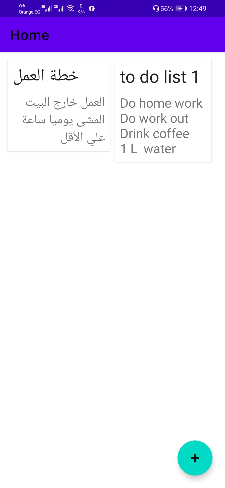
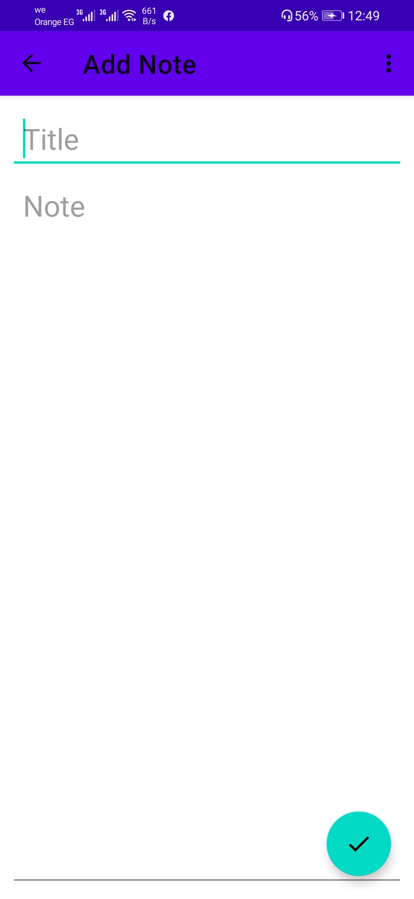
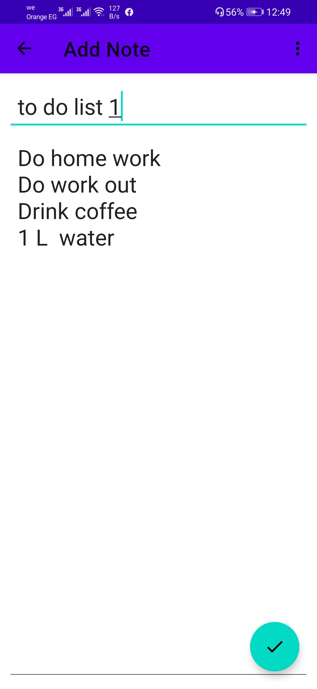
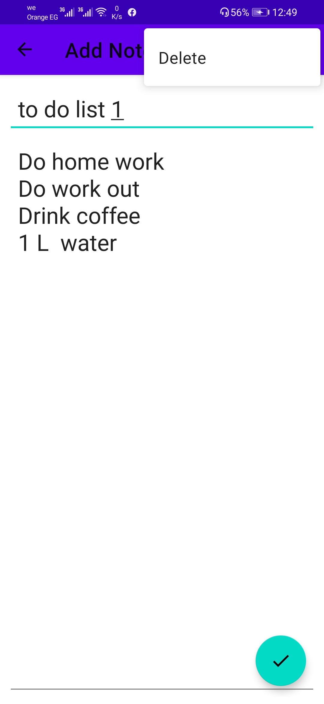

# Android MVVM Note Application

Android Kotlin MVVM Application To save data in local Storage

## Description

user can save his own data or note in a good User interface with title and paragraph in his note he
can edit and delete his note Also

## Technology used

we try to make simple demo As an application on Jetpack compose in AndroidX

## By using

### Kotlin

### Room database

### Kotlin Coroutine

### Navigation

### MVVM - Clean Architect Stage

### Repository Pattern

### Git Flow technic


     


     


## Libraries

```bash
    id 'com.android.application'
    id 'kotlin-android'
    id 'kotlin-android-extensions'
    id 'androidx.navigation.safeargs'
    id 'kotlin-kapt'

```


```bash
//Material Design
 implementation 'com.google.android.material:material:1.8.0'
```

```bash
//room
 implementation "androidx.room:room-runtime:2.5.0"
    kapt "androidx.room:room-compiler:2.5.0"
```

```bash
//Nav Fragment
 implementation "androidx.navigation:navigation-fragment-ktx:2.6.0-alpha04"
    implementation "androidx.navigation:navigation-ui-ktx:2.6.0-alpha04"
```

```bash
//coroutines And coroutines for room
implementation "androidx.room:room-ktx:$room_version"
implementation 'org.jetbrains.kotlinx:kotlinx-coroutines-core:1.3.4'
```

```bash
//coroutines And coroutines for room
implementation "androidx.room:room-ktx:2.5.0"
implementation 'org.jetbrains.kotlinx:kotlinx-coroutines-core:1.6.1'
```

```bash
// Architectural Components
implementation "androidx.lifecycle:lifecycle-viewmodel-ktx:2.5.1"
implementation "androidx.lifecycle:lifecycle-runtime-ktx:2.5.1"
implementation "androidx.lifecycle:lifecycle-livedata-ktx:2.5.1"
```
